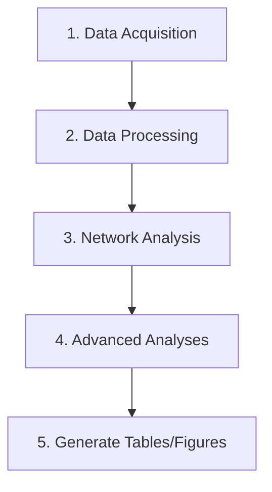

# Analysis Workflow

This document describes the complete workflow for reproducing the paper's analyses, from data acquisition to final results.

## Prerequisites

Before running any analysis:

1. **Install Python 3.10.13** (exact version specified in `.python-version`)
2. **Install dependencies**: `make requirements` or `uv sync`
3. **Activate virtual environment**: `source .venv/bin/activate` (Unix/Mac) or `.\.venv\Scripts\activate` (Windows)

## Workflow Overview



## Step-by-Step Instructions

### Step 1: Data Acquisition and Processing

**Purpose:** Download the dataset from Figshare and process it into structured formats.

**Commands:**
```bash
# Run the complete pipeline (downloads, extracts, and processes)
python pipeline.py
```

**What happens:**
1. Downloads ~GB zip file from Figshare
2. Extracts to `data/interim/extracted/`
3. Processes prevalence data and adjacency matrices
4. Saves processed data to `data/processed/`

**Expected outputs:**
- `data/raw/comorbidity_networks_data.zip` - Downloaded dataset
- `data/interim/extracted/Data/` - Extracted raw data files
- `data/processed/prevalence_data.csv` - Processed prevalence data (if applicable)

**Time:** 10-30 minutes depending on internet speed

---

### Step 2: Network Analysis (Table 1)

**Purpose:** Calculate network properties for all sex-age combinations.

**Commands:**
```bash
# Run network analysis module
python -m tapas.network_analysis

# This is also automatically run by pipeline.py
```

**What it does:**
- Loads adjacency matrices for all combinations (Female/Male × 8 age groups = 16 networks)
- Calculates network metrics:
  - Connected nodes count
  - Average degree
  - Average path length
  - Average betweenness centrality
  - Average closeness centrality
  - Modularity
  - Clustering coefficient
- Generates Table 1 format

**Expected outputs:**
- `data/processed/network_properties_table.csv` - Detailed results
- `data/processed/network_properties_table1_format.csv` - Paper Table 1 format

**Time:** 2-5 minutes

---

### Step 3: Outlier Detection (Supplementary Table S1)

**Purpose:** Identify diseases with unusually high or low degree relative to prevalence.

**Commands:**
```bash
# Outlier detection (automatically run by pipeline)
python -m tapas.analysis.outliers run-outlier-detection
```

**What it does:**
- Calculates degree/prevalence ratio for each disease
- Computes log10(ratio) to handle wide range
- Identifies outliers using 20th/80th percentile thresholds
- Calculates modified z-scores using MAD
- Selects top 20 high-degree and top 10 low-degree outliers per group

**Expected outputs:**
- `data/processed/outliers_data_S1.csv` - Supplementary Table S1

**Configuration:**
- `OUTLIER_LOWER_PERCENTILE = 0.20` in `tapas/analysis_config.py`
- `OUTLIER_UPPER_PERCENTILE = 0.80`
- `OUTLIER_TOP_HIGH = 20`
- `OUTLIER_TOP_LOW = 10`

**Time:** 1-2 minutes

---

### Step 4: High-Mortality Sinks Analysis

**Purpose:** Identify diseases with high betweenness centrality AND high mortality.

**Commands:**
```bash
# Mortality sinks analysis (automatically run by pipeline)
python -m tapas.analysis.outliers run-mortality-sinks
```

**What it does:**
- Calculates z-scores for betweenness and mortality within each sex-age group
- Computes z_product = z_betweenness × z_mortality
- Filters to nodes with BOTH positive z-scores
- Selects top 20% by z-product
- These represent critical intervention points (central + deadly)

**Expected outputs:**
- `data/processed/high_mortality_sinks_ZSCORE.csv`

**Configuration:**
- `HIGH_MORTALITY_TOP_PERCENT = 0.20` in `tapas/analysis_config.py`

**Prerequisites:**
- Mortality data must be in `data/interim/mortality/` directory

**Time:** 1-2 minutes

---

### Step 5: Critical Bridge Edges Analysis

**Purpose:** Identify disease-pair connections with high betweenness AND high mortality difference.

**Commands:**
```bash
# Bridge edges analysis (automatically run by pipeline)
python -m tapas.analysis.bridges main
```

**What it does:**
- Calculates z-scores for edge betweenness and mortality difference
- Computes z_product for edges
- Filters to edges with BOTH positive z-scores
- Applies minimum mortality difference threshold (30%)
- Selects top 5% by z-product

**Expected outputs:**
- `data/processed/bridge_edges_mortality_ZSCORE.csv`

**Configuration:**
- `BRIDGE_TOP_PERCENT = 0.05` in `tapas/analysis_config.py`
- `MIN_MORTALITY_DIFF = 0.30`

**Prerequisites:**
- Mortality data must be available

**Time:** 2-4 minutes

---

### Step 6: Critical Nodes Intersection

**Purpose:** Find diseases that are BOTH high-degree outliers AND high-mortality sinks.

**Commands:**
```bash
# Critical nodes intersection (automatically run by pipeline)
python -m tapas.analysis.critical_nodes main
```

**What it does:**
- Identifies high-degree outliers (from Step 3)
- Identifies high-mortality sinks (from Step 4, with top 40%)
- Finds intersection of both sets
- These are the most critical diseases (highly connected + deadly)

**Expected outputs:**
- `data/processed/critical_nodes_intersection_ZSCORE.csv`

**Configuration:**
- `CRITICAL_NODES_SINK_PERCENT = 0.40` in `tapas/analysis_config.py`

**Time:** 1-2 minutes

---

### Step 7: Advanced Analyses (Table 2)

**Purpose:** Comprehensive analysis including prevalence-degree correlation and high-risk identification.

**Commands:**
```bash
# Advanced analysis (automatically run by pipeline)
python -m tapas.advanced_analysis
```

**What it does:**
1. **Prevalence-Degree Correlation**: Analyzes relationship between disease prevalence and network degree
2. **High-Risk Nodes**: Identifies nodes with high betweenness + mortality (similar to Step 4)
3. **High-Risk Edges**: Identifies edges with high betweenness + mortality difference (similar to Step 5)
4. **Table 2 Generation**: Creates summary table of critical disease counts

**Expected outputs:**
- `data/processed/prevalence_degree_analysis.csv`
- `data/processed/high_risk_nodes.csv`
- `data/processed/high_risk_edges.csv`
- `data/processed/table2_critical_diseases.csv` - Paper Table 2

**Prerequisites:**
- Mortality data must be available
- Prevalence data must be processed

**Time:** 5-10 minutes

---

## Complete Pipeline

To run the entire analysis from start to finish:

```bash
# Single command for full pipeline
python pipeline.py

# This executes all steps automatically
```

**Total estimated time:** 20-60 minutes (depending on download speed and hardware)

---

## Output Summary

After running the complete workflow, you should have:

### Tables
- `network_properties_table1_format.csv` - **Paper Table 1**: Network properties
- `outliers_data_S1.csv` - **Supplementary Table S1**: High/low degree outliers
- `table2_critical_diseases.csv` - **Paper Table 2**: Critical disease node/edge counts

### Analysis Results
- `high_mortality_sinks_ZSCORE.csv` - High-mortality sinks
- `bridge_edges_mortality_ZSCORE.csv` - Critical bridge edges
- `critical_nodes_intersection_ZSCORE.csv` - Critical nodes intersection
- `prevalence_degree_analysis.csv` - Prevalence-degree correlation
- `high_risk_nodes.csv` - High-risk nodes
- `high_risk_edges.csv` - High-risk edges

---

## Troubleshooting

### Problem: Download fails
**Solution:** 
- Check internet connection
- Try manual download from Figshare URL
- Place file in `data/raw/comorbidity_networks_data.zip`
- Re-run pipeline

### Problem: Missing mortality data
**Solution:**
- Advanced analyses require mortality data
- Check if `data/interim/mortality/` exists
- Mortality files should be: `mortality_diag_female.csv` and `mortality_diag_male.csv`
- If missing, some analyses will be skipped (logged as warnings)

### Problem: Environment setup errors
**Solution:**
- Ensure virtual environment is activated
- Install all dependencies using `make requirements`
- Verify Python version 3.10.x is installed

### Problem: "No data found" errors
**Solution:**
- Ensure Step 1 (data acquisition) completed successfully
- Check that `data/interim/extracted/Data/` contains files
- Check that adjacency matrices exist in `data/interim/extracted/Data/3.AdjacencyMatrices/`

---

## Verifying Results

To verify your results match the paper:

1. **Table 1**: Compare `network_properties_table1_format.csv` with paper Table 1
   - Check connected nodes counts
   - Verify network metrics are in expected ranges

2. **Supplementary Table S1**: Compare `outliers_data_S1.csv`
   - Check that top high-degree outliers are reasonable
   - Verify outlier counts per sex-age group

3. **Table 2**: Compare `table2_critical_diseases.csv` with paper Table 2
   - Verify critical node/edge counts
   - Check trends across age groups

---

## Configuration

All analysis parameters are centralized in `tapas/analysis_config.py`. To modify:

1. Edit parameter values (e.g., percentile thresholds)
2. Re-run the pipeline to apply changes
3. Compare results with original parameter values

Parameters control thresholds for outlier detection, high-risk identification, and statistical cutoffs.

---

## Next Steps

After completing the workflow:

1. **Visualization**: All plots are generated automatically in `reports/figures/`
2. **Robustness Analysis**: Test network stability across different thresholds
3. **Result Validation**: Compare generated tables with paper results
4. **Documentation**: Incorporate results into manuscript

---

## References

- **Data Source**: [Comorbidity Networks From Population-Wide Health Data](https://figshare.com/articles/dataset/27102553)
- **Paper**: [Add citation to your paper here]
- **Code Repository**: [Add GitHub/GitLab URL here]
